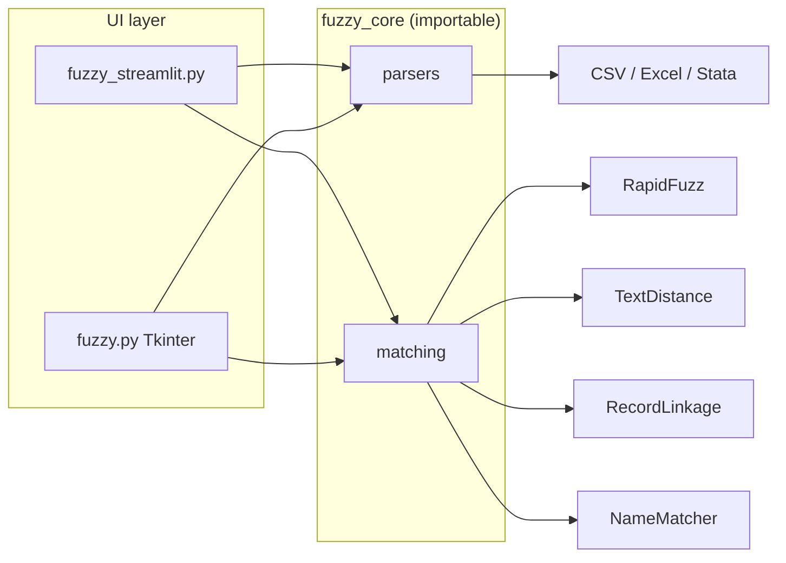

# Fuzzy dataset matcher

[](https://github.com/RajeshTharyan/merge_fuzzy/actions/workflows/pytest.yml)
[](LICENSE)
[](https://codespaces.new/RajeshTharyan/merge_fuzzy)

A small Python tool that fuzzy-matches two tables on shared key columns and
lets you compare four string-similarity libraries on the same input.

There is **no hosted public demo**. Run it locally, in Codespaces, or deploy
your own Streamlit Community Cloud app (instructions below).

---

## The problem

Merging two datasets on names is rarely a clean `pandas.merge`. Company names
differ by legal suffix, word order, abbreviation, and typos (`Apple Inc` vs
`Apple`, `Microsoft Corporation` vs `Microsoft Corp`). This repo is a working
answer to: *given a MASTER table and a USING table, what would several common
fuzzy-matching libraries pick as the best USING row for each MASTER row?*

It is a teaching / portfolio desktop-and-browser tool, not a production entity
resolution pipeline.

## What a visitor should infer

| If you are looking for… | This repo shows… | This repo does **not** show… |
| --- | --- | --- |
| Python data wrangling | pandas I/O for CSV / Excel / Stata; composite keys; joins of match results | Spark, SQL warehouses, streaming |
| String similarity / record linkage | RapidFuzz token-sort, Jaro–Winkler (textdistance), RecordLinkage Jaro, NameMatcher | Blocking, Fellegi–Sunter models, labeled evaluation, 1–1 assignment |
| App design | Streamlit upload → match → download; optional Tkinter GUI sharing the same core | Auth, multi-user sessions, job queues |
| Software structure | `fuzzy_core` is importable; UIs do not own the algorithms | A packaged library on PyPI, plugins, API server |
| Testing / CI | pytest on parsers, key building, scoring, and matchers; GitHub Actions | Load tests, GUI tests, property-based testing |
| Scale | Honest O(n×m) full comparison, documented as a limit | Blocking indexes, approximate nearest neighbors |

## Architecture



- **Parsers** (`fuzzy_core/parsers.py`): detect format from the file suffix,
  load a DataFrame, build a normalized composite key (`lower`, strip, collapse
  whitespace, concatenate selected columns).
- **Matching** (`fuzzy_core/matching.py`):
  - `match_compare` — Streamlit path. Four engines, four score columns.
  - `match_best` — Tkinter path. Highest of RapidFuzz / TextDistance /
    RecordLinkage, then join the USING row. Those three scores are **not**
    calibrated to each other; “best” means “largest raw number.”
- NameMatcher is loaded **once per run** against the USING table (not once per
  MASTER row). RapidFuzz, TextDistance, and RecordLinkage still score each
  MASTER row against every USING key (Cartesian).

## Using the Streamlit app in the browser

1. Start the app (local or Codespaces; port **8501**). You should see the
   title *Fuzzy Dataset Matcher* and a sidebar for uploads.
2. In the sidebar, upload a **MASTER** file and a **USING** file
   (`.csv`, `.xlsx` / `.xls`, or `.dta`). Sample files:
   [`examples/master.csv`](examples/master.csv) and
   [`examples/using.csv`](examples/using.csv).
3. Pick one or more **key columns that exist in both files**. Matching runs on
   the concatenated, normalized values of those columns.
4. Optionally change NameMatcher distance metrics (`bag`, `typo`,
   `refined_soundex`). Clearing the list uses the library defaults.
5. Click **Run Fuzzy Match**. The first 50 rows of the result appear in the
   page. Each MASTER row keeps its original columns plus, for every engine,
   the USING key string, USING index, and score.
6. Choose CSV / Excel / Stata and **Download Results**. Changing the format
   does not re-run matching; results live in `st.session_state`. Uploading a
   different file pair clears the previous result.

Scores from RapidFuzz, TextDistance, and RecordLinkage are on a 0–100 scale.
NameMatcher is shown as the library reports it (also roughly 0–100, and it
can go negative on poor matches).

## Run a copy

Python 3.11 or 3.12.

```bash
python -m venv .venv
source .venv/bin/activate          # Windows: .venv\Scripts\activate
pip install -r requirements.txt
streamlit run fuzzy_streamlit.py
```

Desktop GUI (same core, three engines, writes one file):

```bash
python fuzzy.py
```

Tests:

```bash
pip install -r requirements-dev.txt
pytest
```

### GitHub Codespaces

The [Codespaces badge](https://codespaces.new/RajeshTharyan/merge_fuzzy)
opens this repo with the Dev Container in `.devcontainer/`. After the
`postCreateCommand` finishes:

```bash
streamlit run fuzzy_streamlit.py
```

Forward port 8501 if the UI does not open on its own.

### Streamlit Community Cloud

There is **no** Streamlit Cloud URL for this repository. To host your own
copy: fork the repo, sign in at [share.streamlit.io](https://share.streamlit.io),
and deploy `fuzzy_streamlit.py` from `main`. Treat a public deployment as
unsuitable for confidential files (see [SECURITY.md](SECURITY.md)).

## Honest limits

- **Complexity.** Every MASTER key is compared to every USING key. A few
  hundred rows is comfortable; tens of thousands will be slow or run out of
  memory. RecordLinkage uses a full index (it will log a performance warning).
- **No blocking, no threshold, no unique assignment.** The same USING row can
  “win” for many MASTER rows. Low-quality matches are not dropped.
- **Engines disagree, and that is the point.** Do not treat the Tkinter
  max-score pick as a statistically justified fusion method.
- **NameMatcher is picky.** It is meant for company-like names. On short or
  unrelated strings it can return a weak or negative score and still name a
  “winner.”
- **Formats.** CSV, Excel, and Stata only. Encoding / dtype quirks (especially
  `.dta`) are pandas’ problem, surfaced as an error in the UI.
- **No progress bar, no cancel, no auth.** The Streamlit process holds the
  uploaded tables in memory until the session ends.
- **Not an evaluation kit.** There is no gold-standard F1, no threshold
  tuning UI, and no claim that one library is “best.”

## License

MIT. See [LICENSE](LICENSE).
